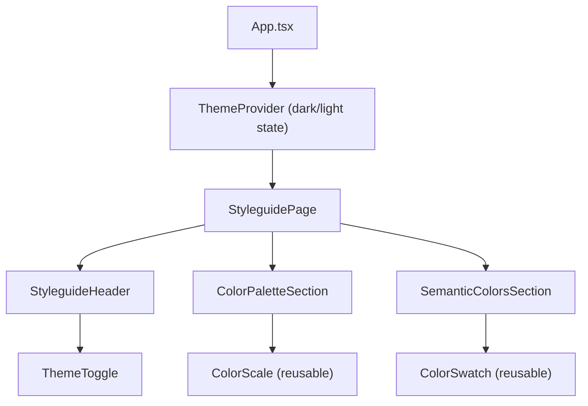

# Paletti Styleguide -- First Step

## Architecture



## 1. Design System CSS: `[src/index.css](src/index.css)`

Rewrite `src/index.css` with a clean design system inspired by `globals_tmp.css` but independent. Key elements:

- **Font imports**: Poppins (headings) + Nunito Sans (body) via Google Fonts
- **Tailwind v4**: `@import "tailwindcss"` + `@custom-variant dark`
- **OKLCH palette generation**: Same `--color-primary-base` / `--color-secondary-base` approach with step-based lightness/chroma interpolation producing shades 50-1100 for both primary and secondary
- `**@theme inline` block\*\*: Register all palette shades, typography tokens, spacing scale, radii, shadows as Tailwind theme values
- **Light mode** (`:root` / `.light`): Map semantic vars (`--background`, `--foreground`, `--primary`, `--secondary`, `--accent`, etc.) to appropriate palette shades
- **Dark mode** (`.dark`): Invert the semantic mappings (lighter shades for primary/secondary, dark backgrounds)
- **Base styles**: body, headings (h1-h4), paragraph, caption, blockquote, links, card utility class
- **Drop all shadcn-specific variables** (sidebar-_, chart-_, popover-\*, etc.) -- only keep semantic colors relevant to this design system

Reference values from `[globals_tmp.css](globals_tmp.css)` lines 8-17 (palette base), lines 242-340 (light/dark semantic mappings).

## 2. Component Structure

All new components go in `src/components/`.

### `ThemeProvider.tsx`

- React context providing `{ theme, toggleTheme }` where theme is `"light" | "dark"`
- On mount + toggle: apply/remove `.dark` class on `document.documentElement`
- Persist preference to `localStorage`

### `ThemeToggle.tsx`

- Sun/Moon icon button using Tabler Icons (loaded via CDN in `index.html`)
- Consumes `ThemeProvider` context to toggle
- Uses `<i class="ti ti-sun">` / `<i class="ti ti-moon">` from Tabler Icons webfont

### `StyleguidePage.tsx`

- Main layout: max-width container, vertical sections
- Renders `StyleguideHeader`, `ColorPaletteSection`, `SemanticColorsSection`
- Uses the design system's background/foreground colors via Tailwind classes

### `StyleguideHeader.tsx`

- Page title "Styleguide" + subtitle
- `ThemeToggle` in the top-right

### `ColorScale.tsx` (reusable)

- Props: `name: string`, `shades: { label: string, colorClass: string }[]`
- Renders a horizontal row of color swatches (50 through 1100) with labels underneath
- Each swatch shows the shade number

### `ColorPaletteSection.tsx`

- Section titled "Color Palette"
- Two subsections: "Primary Color Scale" and "Secondary Color Scale"
- Each uses `ColorScale` with the corresponding `bg-primary-`_ / `bg-secondary-`_ Tailwind classes
- Subtitle "Shades from 50 (lightest) to 1100 (darkest)" like the reference site

### `ColorSwatch.tsx` (reusable)

- Props: `label: string`, `colorClass: string`
- Single color block with label overlay -- used for semantic colors

### `SemanticColorsSection.tsx`

- Section titled with "Light Mode Colors" and "Dark Mode Colors" subsections
- Grid of `ColorSwatch` items for: primary, secondary, accent, background, background-subtle, foreground, foreground-muted
- Light mode section forces `.light` class on its container; dark mode section forces `.dark` class -- so both are visible regardless of the page's current theme (matching the reference site behavior)

## 3. App entry: `[src/App.tsx](src/App.tsx)`

- Wrap everything in `ThemeProvider`
- Render `StyleguidePage`

## 4. File tree after implementation

```
src/
  index.css              -- design system tokens + base styles
  main.tsx               -- unchanged
  App.tsx                 -- ThemeProvider + StyleguidePage
  components/
    ThemeProvider.tsx
    ThemeToggle.tsx
    StyleguidePage.tsx
    StyleguideHeader.tsx
    ColorPaletteSection.tsx
    SemanticColorsSection.tsx
    ColorScale.tsx
    ColorSwatch.tsx
```

## Key Decisions

- **No shadcn** -- all styling is Tailwind utility classes + CSS custom properties
- **Tabler Icons via CDN** -- webfont loaded in `index.html` (`https://cdn.jsdelivr.net/npm/@tabler/icons-webfont@latest/tabler-icons.min.css`), used via `<i>` tags with class names like `ti ti-sun`, `ti ti-moon`
- **OKLCH relative color syntax** -- same approach as `globals_tmp.css` for palette generation; this is a CSS-native feature supported by modern browsers
- `**.dark` class strategy\*\* -- Tailwind v4's `@custom-variant dark` with class toggle, matching the reference site's approach
- **Semantic colors visible in both modes** -- the semantic color sections force their own light/dark context so both are always visible side-by-side, just like goeoeck.dev
